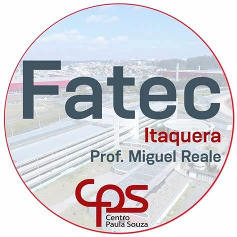

  | <h1>Smart Home Inteligente e Sustentável - TCC FATEC</h1> |  |
|---|---|

## Sobre o Projeto

Este projeto é o Trabalho de Conclusão de Curso (TCC) do curso de Automação Industrial da FATEC. O objetivo é desenvolver uma casa inteligente, sustentável e totalmente automatizada, que ofereça conforto, segurança e eficiência energética.

## Funcionalidades

- Controle automatizado de portas e portões
- Sistema de iluminação RGBWW com controle remoto
- Monitoramento e controle do ar condicionado
- Segurança integrada com biometria e câmeras
- Uso de painéis solares para energia sustentável
- Sensores ambientais, como sensor de chuva e temperatura
- Automação da piscina com hidromassagem e cascata
- Interface centralizada para controle e monitoramento

## Tecnologias Utilizadas

- IoT (Internet das Coisas)
- Automação Industrial
- Sensores e atuadores diversos
- Programação embarcada (Arduino, ESP)
- Painéis solares e sistemas energéticos
- Desenvolvimento de interfaces (futuro)

## Status do Projeto

O projeto está em desenvolvimento, com as fases de levantamento de requisitos, modelagem e prototipação em andamento.

## Contato

Erika Nova  
[Seu email ou LinkedIn, se quiser]
