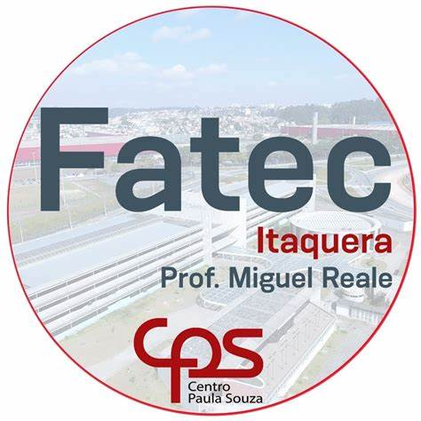

<h1 align="center">🏠 Smart Home Inteligente e Sustentável</h1>

  

  <strong>Projeto de TCC - FATEC | Curso de Automação Industrial</strong>

---

## 📌 Sobre o Projeto

Este repositório contém o Trabalho de Conclusão de Curso (TCC) da FATEC, com foco no desenvolvimento de uma **casa inteligente automatizada, sustentável e adaptável**. O projeto busca aliar tecnologia e conforto com eficiência energética e acessibilidade, utilizando plataformas modernas como **Zigbee2MQTT**, **Home Assistant**, e **Integração com IA**.

Uma **maquete física funcional** foi construída para representar o sistema em escala real.

---

## 💡 Funcionalidades

- 🔐 Controle automatizado de **portas e portões**
- 💡 Sistema de **iluminação RGBWW inteligente**
- 🌡️ Monitoramento de **climatização e temperatura**
- 📷 Segurança com **biometria e câmeras com IA**
- ☀️ Geração de energia com **painéis solares**
- 🧠 Integração com **Alexa e Inteligência Artificial**
- 🌧️ Sensores de **chuva, temperatura, presença, etc.**
- 🏊 Piscina com **hidromassagem e cascata**
- 🖥️ Centralização de comandos via **dashboards e automações**

---

## 🛠️ Tecnologias Utilizadas

- 🧩 **Zigbee2MQTT** e **Home Assistant**
- 🔌 **ESP32**, **Arduino UNO**
- 🌐 **MQTT**, **Node-RED**
- 🧠 **Integração com Alexa e IA personalizada**
- 📷 Câmeras com processamento local (IA)
- 💡 Sensores e atuadores (relés, DHT22, servos, etc.)
- 📦 Instalação elétrica, painéis e quadro de distribuição
- 🏠 Maquete física em escala

---

## 📈 Status do Projeto

| Etapa                                     | Progresso |
|------------------------------------------|-----------   |
| Maquete física                            | ✅ 100%    |
| Pintura da maquete                        | ✅ 100%    |
| Integração com IA e Alexa                 | ✅ 100%    |
| Câmera com inteligência artificial        | 📷 90%     |
| Piscina com hidromassagem/cascata         |  🏊 70%    |
| Automação geral dos dispositivos          | ⚙️ 70%     |
| Energia no painel de distribuição         | ⚡ 90%     |
| Energia elétrica funcional na maquete     | ⚡ 80%     |
| Quadro de energia e distribuição          | ⚙️ 80%     |
| Garagem automatizada                      | 🚗 10%     |
| Programação e lógica                      | ✅ 100%    |

---

## 🤖 Desenvolvido por

**Erika Nova,** **Kenedy Santos,** **Miguel Valverde,** **Patrick Zacarioto.**

Estudante de Automação Industrial - FATEC  

---

## 📝 Licença

Este projeto é acadêmico e de uso livre para fins educacionais.
