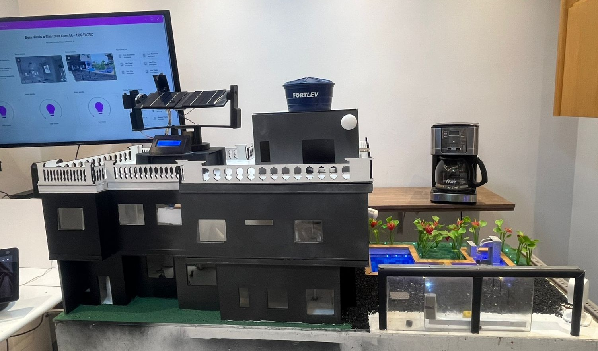
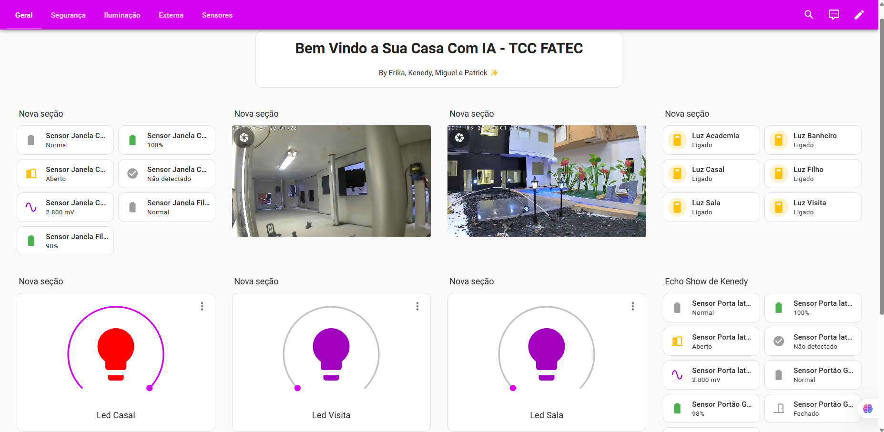
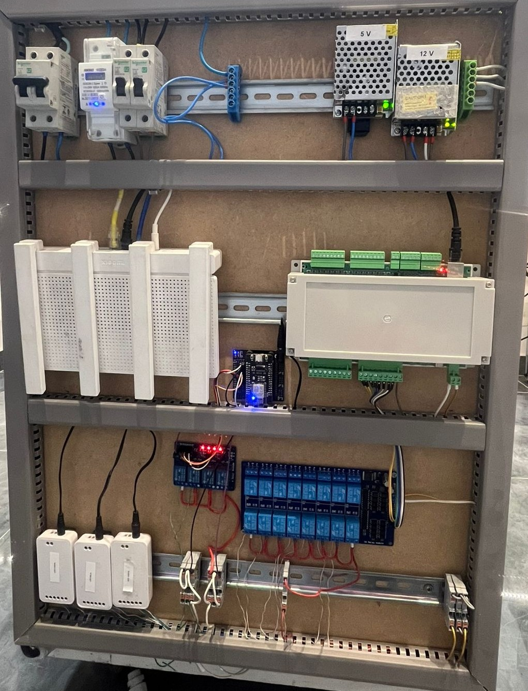

<h1 align="center">🏠 Smart Home Inteligente, Sustentável e Adaptável</h1>

  

  <strong>Trabalho de Conclusão de Curso – FATEC | Curso de Automação Industrial</strong>

---

## 📌 Sobre o Projeto

Este repositório apresenta o desenvolvimento de uma **casa inteligente, sustentável e adaptável**, criada como Trabalho de Conclusão de Curso (TCC) da FATEC. A proposta une **automação residencial, eficiência energética e inteligência artificial**, promovendo conforto, segurança e acessibilidade em uma maquete funcional que representa fielmente um sistema real.

A residência é comandada por uma **IA embarcada**, capaz de tomar decisões com base em comportamentos, interpretar o ambiente em tempo real e agir preventivamente diante de situações incomuns elevando o conceito de smart home a um novo patamar.

---

## 💡 Funcionalidades Principais

- 🔐 Abertura e fechamento automatizados de **portas e portões**
- 💡 Controle de **iluminação RGBWW** com adaptação ao ambiente
- 🌡️ Monitoramento climático com sensores de **temperatura e umidade**
- 📷 **Segurança inteligente** com reconhecimento facial e alertas contextuais
- ☀️ Geração de energia com **painéis solares** integrados
- 🧠 **IA embarcada** que aprende rotinas, reconhece padrões e atua de forma autônoma
- 🌧️ Sensoriamento de **chuva, luminosidade, movimento e presença**
- 🏊 Controle automatizado de **piscina com hidromassagem e cascata**
- 🖥️ Acesso completo via **dashboards remotos e assistentes de voz**

---

## 🛠️ Tecnologias e Arquitetura

- **ESP8266 com firmware Tasmota**, para controle dos dispositivos conectados  
- **Zigbee2MQTT** e sensores compatíveis para comunicação segura e eficiente  
- **Home Assistant** como plataforma central de automação  
- **Node-RED** para lógica inteligente e automações visuais  
- **Broker MQTT local (Aedes)** para interligação de sensores e atuadores  
- **AWS (Amazon Web Services)** como infraestrutura em nuvem para conectividade, monitoramento remoto e processamento de dados da IA  
- **Visão computacional embarcada** para reconhecimento de rostos, vestimentas e movimentos suspeitos  
- **IA adaptativa** que aprende comportamentos e reage a padrões fora do comum  
- **Painel elétrico real** com quadro de distribuição e instalação funcional  

---

## 📷 Galeria do Projeto

  
  
  

---

## 🎥 Demonstração no YouTube

> Veja o funcionamento completo da nossa **Smart Home Inteligente, Sustentável e Adaptável** em vídeo!

  

---

## 👨‍💻 Equipe de Desenvolvimento

**Erika Nova**  
**Kenedy Santos**  
**Miguel Valverde**  
**Patrick Zacarioto**

Estudantes do curso de **Automação Industrial – FATEC Itaquera**

---

## 📄 Licença

Este projeto possui caráter **acadêmico** e está disponível para fins educacionais, exposições e como referência para soluções de automação residencial com inteligência artificial.

---
